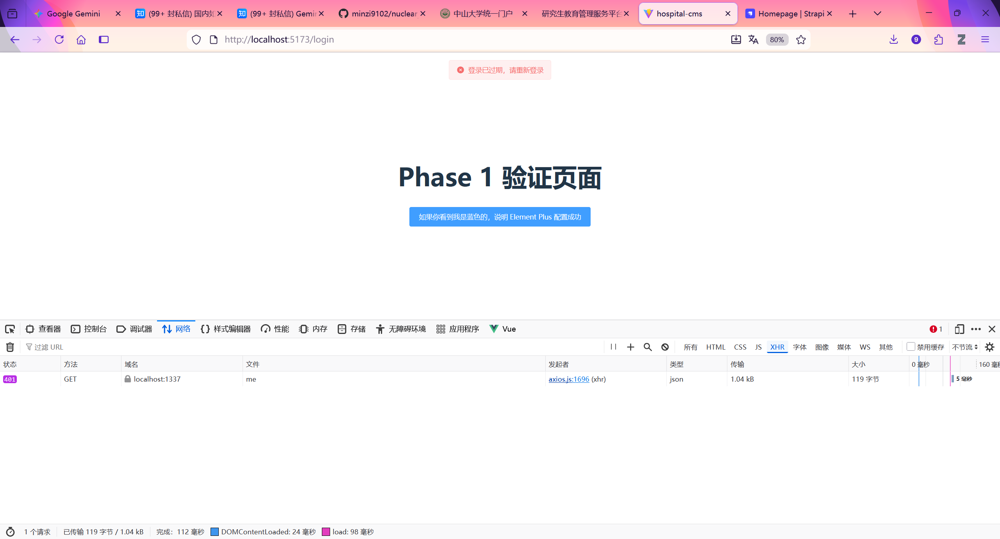

# 前端开发实战记录 - Phase 1：环境搭建与基础配置

日期：2025年12月01日
项目名称：hospital-cms (治疗效果记录管理平台)
技术栈：Vue 3 + TypeScript + Vite + Element Plus + Pinia + Axios

## 1. 🚀 操作步骤记录

### 1.1 初始化项目

使用 Vite 脚手架快速生成 Vue 3 + TypeScript 项目模板。
```bash
# 在目标目录下创建项目
npm create vite@latest hospital-cms -- --template vue-ts
```

### 1.2 安装核心依赖

安装项目所需的 UI 库、路由、状态管理和网络请求库。
```bash
cd hospital-cms
npm install element-plus axios pinia vue-router
```

### 1.3 基础文件配置

*   `src/router/index.ts`：创建了基础路由文件，暂时指向登录页。
*   `src/main.ts`：在入口文件中挂载了 Element Plus、Pinia 和 Router。

### 1.4 🧪 核心任务：Axios 封装 (src/utils/request.ts)

为了统一处理前后端交互，封装了 Axios 实例：

*   `BaseURL`：配置为 `http://localhost:1337/api` (Strapi 后端地址)。
*   **请求拦截器**：自动从 `localStorage` 读取 JWT Token 并加入 Header (`Authorization: Bearer <token>`)。
*   **响应拦截器**：全局处理错误，特别是 `401 Unauthorized` 状态下自动清除缓存并跳转回登录页。

## 2. 🐛 遇到的问题与解决方案 (Troubleshooting)

在配置过程中遇到了 3 个主要错误，均已解决。

### 🔴 问题一：找不到路由模块

报错信息：
```
找不到模块“../router”或其相应的类型声明。ts(2307)
```
原因分析：utils文件夹放错了位置，导致相对路径引用错误。

✅ 解决方案： 将utils文件夹放在src文件夹下，而不是与src同级

### 🔴 问题二：Axios 类型导入错误

报错信息：
```
“AxiosInstance”是一种类型，必须在启用 "verbatimModuleSyntax" 时使用仅类型导入进行导入。ts(1484)
```
原因分析： Vite 默认开启了 `verbatimModuleSyntax` 规则。TypeScript 要求在导入“纯类型”（在编译后会被删除的代码）时，必须使用 `import type` 语法，而 axios 是实体对象，不能混在一起导入。

✅ 解决方案： 将导入语句拆分为“实体导入”和“类型导入”：
```typescript
// 修改前
import axios, { AxiosInstance, ... } from 'axios'

// 修改后
import axios from 'axios' // 导入功能
import type { AxiosInstance, AxiosError, ... } from 'axios' // 导入类型定义
```

### 🔴 问题三：无法启动项目 (ENOENT)

报错信息：
```
npm error code ENOENT Could not read package.json
```
原因分析： 在执行 `npm run dev` 时，当前所在的目录是项目的父级文件夹，而不是项目文件夹本身。npm 找不到 `package.json` 配置文件。

✅ 解决方案： 进入项目文件夹后再运行命令：
```bash
# 查看当前目录下的文件夹
dir

# 进入项目文件夹
cd hospital-cms

# 再次安装依赖（保险起见）并启动
npm install
npm run dev
```

## 3. 🎉 阶段成果

*   ✅ Node.js 环境验证通过。
*   ✅ Vue 3 项目骨架搭建完成。
*   ✅ 核心依赖库安装完毕。
*   ✅ Axios 网络请求层封装完毕（含 Token 拦截逻辑）。
*   ✅ 项目成功启动在 `http://localhost:5173`。

## 4. 验证该阶段成果是否达成预期目标

验证 Phase 1（环境与基础）是否成功的最佳方式，是进行一次**“冒烟测试” (Smoke Test)**。

我们需要验证三件事：

*   Element Plus 样式是否加载成功？
*   Axios 能否发请求？
*   拦截器 是否真的把 Token 塞进了请求头？

请按照以下步骤，修改 `src/App.vue` 文件进行临时测试。

🧪 第一步：编写测试代码

请打开 `src/App.vue`，完全清空里面的内容，粘贴以下代码。

这段代码做了两件事：

*   放了一个 Element Plus 的按钮（测试 UI）。
*   在页面加载时，手动存入一个假 Token，并尝试发一个请求（测试 Axios）。

代码段

```vue
<script setup lang="ts">
import { onMounted } from 'vue'
import { ElMessage } from 'element-plus'
import request from './utils/request' // 引入我们封装的 axios

onMounted(async () => {
  // 1. 模拟登录：手动往 localStorage 存一个假的 token
  localStorage.setItem('jwt', 'test-fake-token-123456')
  console.log('✅ 已存入测试 Token')

  try {
    // 2. 发起一个请求 (请求 Strapi 的默认公开接口，或者故意请求一个不存在的接口)
    // 这里我们请求 /users/me，通常这需要权限，正好测试 401/403 拦截器
    // 或者请求一个不存在的地址测试 404
    const res = await request.get('/users/me')
    console.log('请求成功:', res)
  } catch (error) {
    console.log('❌ 请求被拦截器捕获 (这是预期的):', error)
  }
})
</script>

<template>
  <div style="padding: 50px; text-align: center;">
    <h1>Phase 1 验证页面</h1>
    <el-button type="primary" size="large">
      如果你看到我是蓝色的，说明 Element Plus 配置成功
    </el-button>
  </div>
</template>

<style>
/* 简单的居中样式 */
body {
  margin: 0;
  display: flex;
  place-items: center;
  min-width: 320px;
  min-height: 100vh;
}
</style>
```

🔍 第二步：在浏览器中验证

*   确保终端里 `npm run dev` 正在运行。
*   打开浏览器访问 `http://localhost:5173`。
*   按 `F12` 打开开发者工具 (`DevTools`)。

✅ 验证点 1：UI 库是否生效

*   看页面：你是否看到了一个蓝色的、圆角的大按钮？
*   判断：如果按钮是蓝色的，说明 Element Plus 样式引入成功。如果只是普通的灰色直角按钮，说明 `main.ts` 里的样式引入有问题。

✅ 验证点 2：请求拦截器 (Token 注入)

这是最关键的一步。

*   在开发者工具中，切换到 `Network (网络)` 标签页。
*   刷新页面。
*   在 `Network` 列表中找到名为 `me` (或者你请求的路径) 的红色请求。
*   点击这个请求，在右侧查看 `Headers (标头) -> Request Headers (请求标头)`。
*   检查：你能找到一个叫 `Authorization` 的字段吗？它的值是 `Bearer test-fake-token-123456` 吗？
    *   成功：说明你的 `request.ts` 里的请求拦截器工作完美！它自动读取了本地缓存并加上了头。

✅ 验证点 3：响应拦截器 (错误处理)

*   看页面顶部是否弹出了一个红色的提示框 (`Message`)？
    *   提示内容可能是“登录已过期”或“Forbidden”或“Not Found”。
*   判断：
    *   如果你用了假 Token 请求 `/users/me`，Strapi 后端会返回 `401` 或 `403`。
    *   如果页面弹出了红色的 `ElMessage` 提示框，说明你的响应拦截器成功捕获了错误并进行了反馈。
    *   如果你刚才在 `request.ts` 里写了 `router.push('/login')`，你甚至会发现浏览器的地址栏变成了 `http://localhost:5173/login`。

    

🧹 第三步：清理现场

验证全部通过后，说明地基非常牢固。请执行以下清理操作，为 Phase 2 做准备：

*   还原 `App.vue`：将 `App.vue` 恢复成最简单的 `<router-view />`，以便后面由路由控制页面显示。

修改 `src/App.vue` 为：
代码段

```vue
<script setup lang="ts">
</script>

<template>
  <router-view />
</template>

<style>
/* 全局样式重置，可选 */
html, body, #app {
  height: 100%;
  margin: 0;
  padding: 0;
}
</style>
```

*   清除假 Token：

    *   在浏览器控制台 (`Console`) 输入：`localStorage.clear()` 并回车。